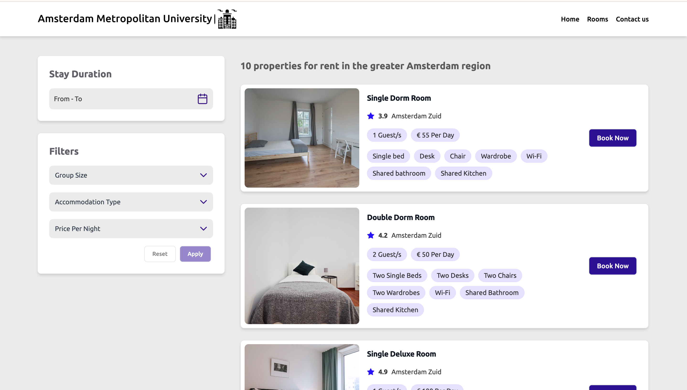

<h1 align="center">Book a Room for Student Housing</h1>

  

# Get started with the GoMeddo JS SDK

This project uses the [GoMeddo JS SDK](https://github.com/gomeddo/js-sdk) to implement an application that lets a user book a room in a student housing via [GoMeddo](https://gomeddo.com).

## Demo

You can find a demo [here](https://gomeddo-activity-scheduling-and-registration.vercel.app/home).

## High-Level Use Case

This example provides a starting point for integrating _GoMeddo's_ "**room booking**" capabilities into your website using the Javascript SDK.

The example demonstrates this by allowing students to book a room for student housing at the Amsterdam Metropolitan University. While focused on student housing bookings, it demonstrates the process and structure needed for a range of room booking scenarios.

## Overview of User Interaction on the Frontend

The dashboard of the application lists various available rooms which can be filtered based on room type, price and group size. Once a user selects a room from available rooms, the 'Book Now' button is visible on the UI. Users will then be prompted to input their contact information and make their reservation for the selected room.

## GoMeddo setup

- The various rooms are a resource of type **room** in _GoMeddo_ with descriptions, pricing and images etc, attached to them.
- The rooms are located in a **student housing** (Amsterdam Metropolitan University) which is also a resource in _GoMeddo_.
- Amsterdam is the **city** where the rooms are located.
- Visitors of the room become contacts in Salesforce using **reservation contacts**.
- The booking becomes a reservation in _GoMeddo_ of type **student housing**.
- The location where the room is available is a **resource** in _GoMeddo_ with a specific **resource type**
  - **City**: Amsterdam is categorized as a city.
  - **Student Housing**: Amsterdam Metropolitan University is categorized as a student housing.
  - **Room**: Specific rooms are identified within Amsterdam Metropolitan University such as (e.g., Single Room, Double Room), each with a type room.
- **Custom Fields Creation**: To use and display information from other objects, we must introduce custom fields within the Salesforce reservation object, such as Housing_Location**c, Housing_Features**c, etc. These fields are essential for getting detailed information about each room.
- **Resource Details Setting:** Ensure that each resource in GoMeddo is marked as '**_isActive_**' and '**_Api Visible_**' to be displayed and available through the API.

Ensure that **resources**, **resource types**, **availability periods**, and **reservation types** are set up in _GoMeddo_ for the booking system to accurately display available rooms. This step is vital as the SDK relies on the setup to present students with real-time availability and booking options to make **reservations**.

## API Key Requirement

To access the SDK’s functionalities,

an API key from _GoMeddo_ is required. For instructions on obtaining this key, refer to [First time Set-up](https://gomeddo.atlassian.net/wiki/spaces/WID/pages/3353837569/First+time+Set-up). Remember to **whitelist** your domain as a part of the setup process and grant **privileged** access to the API key.

### UI Setup

The UI is built as a React website which can be accessed by users to make reservations. The code is organized as a standard React application which communicates with GoMeddo to make reservations.

Perform the following steps to run the project in a local environment.

- Clone the code to a local repository
- Install necessary dependencies and packages by running `npm install`
- Start the local dev server using the command `npm run start`

#### Link to Github and Wiki

For further information on utilizing the GoMeddo Javascript SDK, visit [GoMeddo JS SDK wiki](https://github.com/GoMeddo/js-sdk/wiki).

#### Similar use cases

- Book meeting rooms for corporate events
- Reserve study rooms in libraries
- Schedule conference rooms for business meetings
- Reserve practice rooms for music students
- Book private rooms for therapy sessions
